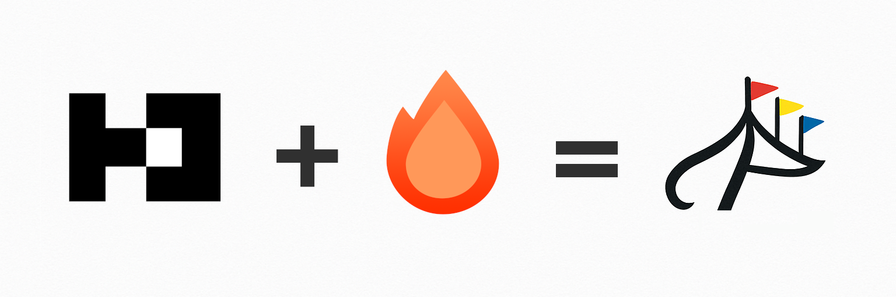

  <picture>
    <source srcset="./assets/combo-dark.png" media="(prefers-color-scheme: dark)">
    <source srcset="./assets/combo.png" media="(prefers-color-scheme: light)">
    
  </picture>
  

    Better Auth + Hono = Faire Auth
     
    <a href="https://faire-auth.com"><strong>Learn more »</strong></a>
     
     
    <a href="https://faire-auth.com">Website</a>
    ·
    <a href="https://github.com/igoforth/faire-auth/issues">Issues</a>
  

## About the Project

Faire Auth is a ground-up rebuild of [Better Auth](https://github.com/better-auth/better-auth) on [Hono](https://hono.dev). It provides comprehensive authentication and authorization for TypeScript with typed middleware, route hooks, DTO transforms, and a plugin architecture designed for composability. It runs on any Hono-compatible runtime — Node.js, Bun, Deno, Cloudflare Workers, and edge runtimes.

## Contribution

Faire Auth is free and open source project licensed under the [GNU Affero General Public License v3.0](./LICENSE).

You could help continuing its development by:

- [Contribute to the source code](./CONTRIBUTING.md)
- [Suggest new features and report issues](https://github.com/igoforth/faire-auth/issues)

## Security
If you discover a security vulnerability within Faire Auth, please report it via a [GitHub security advisory](https://github.com/igoforth/faire-auth/security/advisories/new).

All reports will be promptly addressed, and you'll be credited accordingly.
